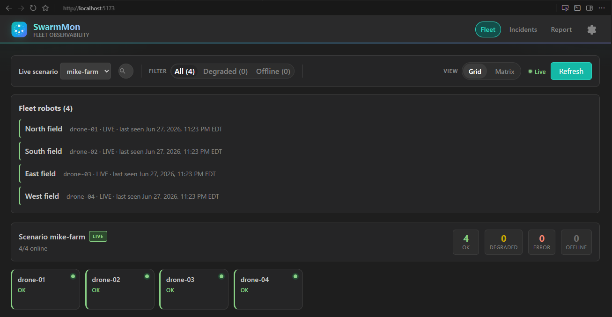

# SwarmMon

[](https://github.com/K-bhuvan/SwarmMon/actions/workflows/ci.yml)

**Fleet observability for robots in the field** : drones, AMRs, harvesters, or any fleet that reports status over ROS.

SwarmMon **watches** your robots; it does not drive them. One dashboard, offline detection, and email alerts when units stop checking in.



---

## Example: Mike’s farm

Mike has **4 crop-monitoring drones** (north, south, east, west fields). SwarmMon runs in the background : **he gets one email when something goes wrong**, not a separate alert per drone. He opens the dashboard only when he wants details.

**Setup (once, by an integrator):** the drones already publish status on the farm’s robot network. One **gateway** on a barn PC reads that feed and sends it to SwarmMon. Mike uses the web app and email; nothing is installed on the drones.

```text
drone-01 … drone-04
        ↓
/swarmmon/fleet/status  (JSON on ROS)
        ↓
gateway on barn PC  →  SwarmMon  →  dashboard + email
```

Fleet **`mike-farm`** · robots **`drone-01` … `drone-04`** · topic **`/swarmmon/fleet/status`**

Full pilot steps: [docs/first_client_deploy.md](docs/first_client_deploy.md) · message schema: [docs/fleet_ingest_standard.md](docs/fleet_ingest_standard.md)

### Try it locally (3 terminals)

Ubuntu or WSL (not PowerShell). One-time: `./scripts/setup.sh`

```bash
# 1 : API
cp backend/.env.example backend/.env
./scripts/dev_backend.sh

# 2 : UI
./scripts/dev_dashboard.sh
# → http://localhost:5173

# 3 : onboard + sample fleet
export SWARMMON_ALERT_EMAIL=mike@example.com   # optional
./scripts/onboard_field_fleet.sh
conda deactivate && ./scripts/ros2_mike_fleet.sh --dev
```

Select **mike-farm** on the dashboard : four drones auto-register within seconds. Production: run the gateway without `--dev`; real robots publish the same topic.

---

## For developers

```text
ROS topic or single-robot harness
        ↓
agent (gateway / publisher)
        ↓
POST /api/v1/fleet/ingest
        ↓
dashboard · incidents · alert worker
```

### Step-by-step flow (local dev)

Use the [3-terminal commands above](#try-it-locally-3-terminals) on Ubuntu or WSL. Each step feeds the next:

| Step | You run | What happens |
|------|---------|--------------|
| **1 : Backend** | `./scripts/dev_backend.sh` | FastAPI on `:8000`, SQLite DB. Exposes ingest, fleet read APIs, and alert worker. |
| **2 : Dashboard** | `./scripts/dev_dashboard.sh` | React UI on `:5173`. Polls `GET /api/v1/fleet?scenario_run_id=mike-farm` every ~2s. Does **not** talk to ROS. |
| **3a : Onboard** | `./scripts/onboard_field_fleet.sh` | `POST /api/v1/fleet/onboard` creates fleet **`mike-farm`** and alert settings. Required before ingest (otherwise gateway gets 404). |
| **3b : Gateway** | `./scripts/ros2_mike_fleet.sh --dev` | See data path below. Without `--dev`, only the gateway runs : real robots must publish the topic. |

**Data path after step 3b (`--dev`):**

```text
FleetStatusPublisher          FleetGateway                 Backend
(fake drones, ~30s)           (always on)
        │                            │
        └─► /swarmmon/fleet/status ──┤ subscribe (JSON String)
                                     │
                                     └─► POST /api/v1/fleet/ingest
                                              │
                                              ├─ auto-register drone-01 … drone-04
                                              ├─ heartbeats + battery diagnostics
                                              └─ health rules → incidents / email
                                                       │
Dashboard ◄── GET /api/v1/fleet ──────────────────────┘
```

**Gateway detail:** `FleetGateway` (`agent/.../fleet_gateway.py`) parses each ROS message as JSON and forwards it unchanged to the backend. Optional header `X-SwarmMon-Key` when `SWARMMON_INGEST_API_KEY` is set. Schema: [docs/fleet_ingest_standard.md](docs/fleet_ingest_standard.md).

**Single-robot path:** `./scripts/ros2_live.sh` uses a different harness topic and scenario (`run-ros2-live`) : same backend ingest pattern, one robot. See [docs/ros2_live.md](docs/ros2_live.md).

| Platform | Notes |
|----------|--------|
| Ubuntu 22.04 / 24.04 | Primary |
| WSL2 + Ubuntu | Same scripts; use WSL terminal |
| Windows native | Not supported for this repo |
| macOS | Not tested |

```bash
git clone https://github.com/K-bhuvan/SwarmMon.git ~/projects/SwarmMon
cd ~/projects/SwarmMon && chmod +x scripts/*.sh && ./scripts/setup.sh
```

**Prerequisites:** Python 3.11+, Node 20+, ROS 2 Jazzy or Humble (agent scripts).

| Script | Role |
|--------|------|
| `dev_backend.sh` | API on `:8000` |
| `dev_dashboard.sh` | UI on `:5173` |
| `onboard_field_fleet.sh` | Register a field fleet |
| `ros2_mike_fleet.sh` | Field gateway (`--dev` = fake drones) |
| `ros2_live.sh` | Single-robot harness (signals / faults demo) |

| Path | Purpose |
|------|---------|
| `agent/` | ROS gateway and harness |
| `backend/` | FastAPI, ingest, alerts |
| `dashboard/` | React fleet UI |
| `docs/` | [Documentation index](docs/README.md) |

API: [backend/README.md](backend/README.md) · environment: [docs/dev_environment.md](docs/dev_environment.md)

```bash
docker compose -f examples/docker-compose.yml up --build   # backend + UI only; ROS agent still on host
```

---

## License

GNU Affero General Public License v3.0 — see [LICENSE](LICENSE) and [NOTICE](NOTICE).

## Disclaimer

SwarmMon is not a safety-rated system. See [DISCLAIMER.md](DISCLAIMER.md).
